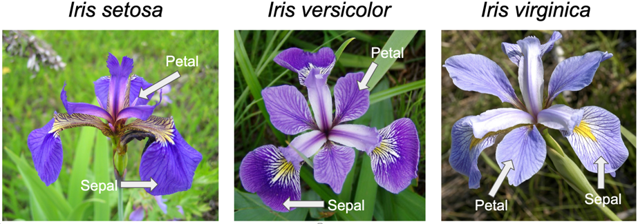
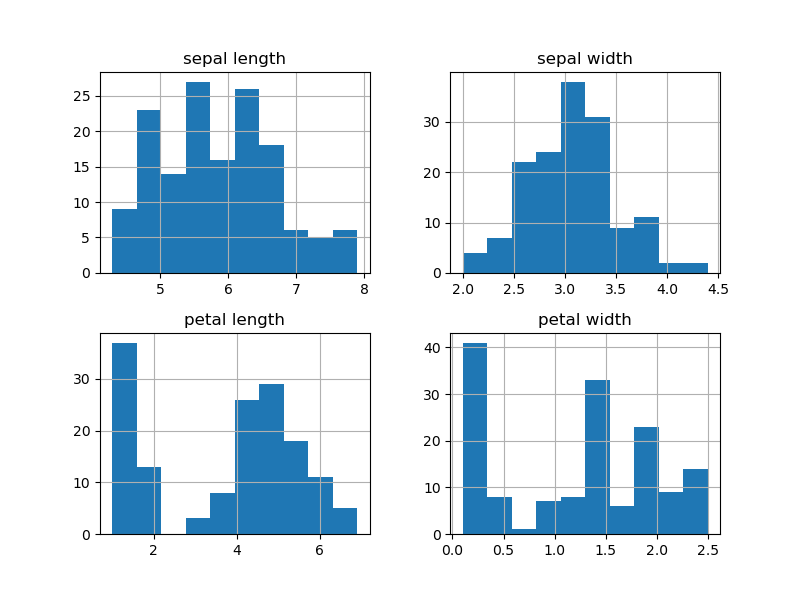
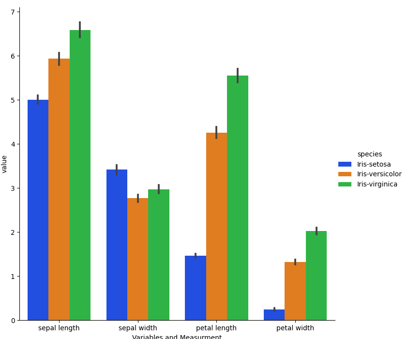
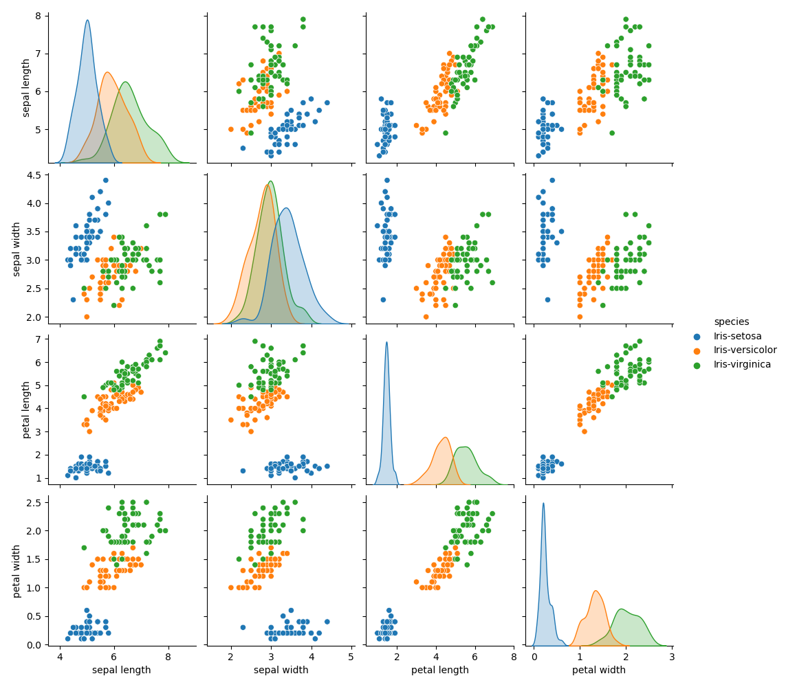
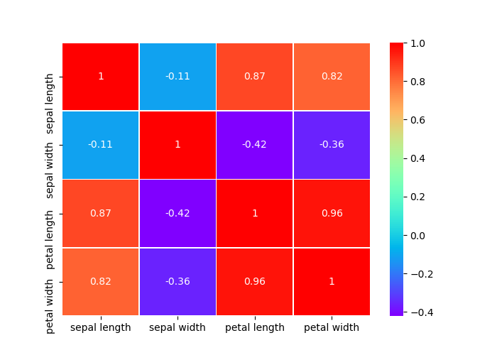
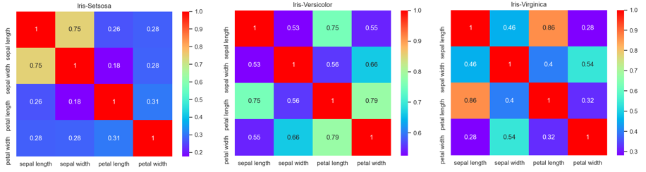
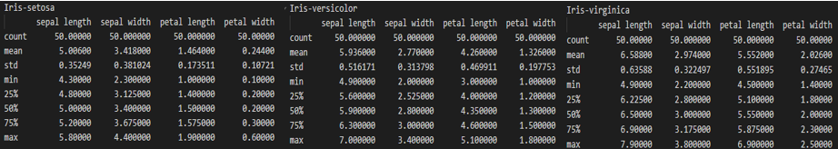

# Pands-Project2021
Project Repository for Programming and Scripting Module GMIT - 2021

### Introduction
This is a project that is going to look at the data that is commonly known as the Iris Flower Dataset or Fishers Iris dataset. 
During the research phase for this project I found that the study of this dataset seems to be the initial starting point for any would-be statistician or individual interested in studying Machine Learning and/or data visualisation.
The Dataset came to the public forefront in 1936 when statistician Sir Ronal Aylmer Fisher published his report “The Use of Multiple Measurements in Taxonomic Problems” in the journal Annals of Eugenics.
It should be noted that Fisher did not collect the data himself, the data-source was credited to Dr Edgar Anderson who collected the data at the Gaspé Peninsula in Canada.   

The dataset in itself is relatively small - 3 classes (different Iris Species - Iris Setosa, Iris Versicolour and Iris Virginica) with 50 samples of each and 4 variables of each sample (the length and width of the sepal and the length and width of the petal in centimetres). 
One species, Iris Setosa, is "linearly separable" from the other two. This means that we can draw a line between Iris Setosa samples and samples corresponding to the other two species.

From initial research it was clear that this dataset has been analysed in depth by thousands of scholars before me and there was going to be many ways to look at and represent this data.   

### Planned Project Outcomes
1. To break the project down into small managable tasks  
2. To gain an understanding of the data presented in the Iris Data set
3. To integrate the skills I had aquired over the first 10 weeks of the programming and scripting module to analyse the data and display the findings
4. To expand my knowledge of the python libaries and tools to make the code as simple and readable as possible for the reader
5. To learn how to best optimise my time between research, programming, problem-solving and analysing.  

### The Repository Content
  - README File that contains a description of the dataset and its history. Also includes the tools used in the completion of the project and an explanation of the code and how I proceeded to analyse the data
  - Iris data file. This is the data set that was analysed. This was read by the programs using the PANDAS liberary in python.
  - The programs that I used in analysing and displaying the data. These included comments to show my understanding of the code and the were vital when documenting my analytical process.

### Python and the Libaries Used
Python programming language is acclaimed for its capacity of handling large amount of data in scientific community of different specialisation. Its natural functionality has been extended by development of external libraries dedicated for specific purposes. Below are listed several I used for accomplishment of this project.

- Pandas:
Pandas is a software library written for the Python programming language for data manipulation and analysis. In particular, it offers data structures and operations for manipulating numerical tables and time series. It was used specifically in this project to read in the data from the csv file used.

- Numpy:
NumPy is a library for the Python programming language, adding support for large, multi-dimensional arrays and matrices, along with a large collection of high-level mathematical functions to operate on these arrays.

- Matplotlib:
Matplotlib is a plotting library for the Python programming language and its numerical mathematics extension NumPy.

- Seaborn: 
Seaborn is a Python data visualization library based on matplotlib. It provides a high-level interface for drawing attractive and informative statistical graphics.

### Initial Research
As this was my first programming project I found the initial research of this dataset a little daunting.
There were so many ways that that this data had been previously researched and visualised in a range of disiplines - Statistics, Machine Learning, Data Representation, Data Visulaisation to name a few. It was difficult to wrap my head around how this seemingly simple set of flower types and their four common, but variable attributes, were a recognised building block of some of the most intricate and complex tools that are used in computing and data science today.
After some initial headscratching google searchs I decided to start at the beginning and have a look at Fishers origial report - this helped a little as it really showed me he was just looking at these 150 flowers as a specific data set and not trying to gleen any information that was not already supplied by the numbers provided to him, even if some of the mathamathics involved was beyond my comprehension. From my reading of the original report, i deduced that Fisher was outlining, that by interpreting the data from these 3 species of Iris', we could identify the species of any of these iris' by using the measurements of the Sepal and Petal. 
This gave me a little confidence in the sense that I should just start from the begining with no preconcieved notions about what data was going to show me and just begin to use the skills I had aquired in my short time learning python to generate a picture of what the data was trying to display. I could dive into the further uses for how the method of my analysis could be used in other applications at a later time.

Once I felt I had done adaquete research on what the data was I decided to try some simple code to output some plots, if for nothing else to have some "physical" evidence that I was making progress. The first decision I had to make was how did I want to have the data stored. I decided CSV was my best option - I was familiar with the CSV format from some light database work I had done in my professional life (importing and exporting data mainly - no real analysis) and this would be the format I would be continuing to use professionaly, so that decision was one of the easier ones I would make.
From there I did some more research and reviewed some previous labs that had touched on CSV data during the course. There was so much I decided to create a new bookmarks folder in Chrome called "Pandas Project Bookmarks" - and I edited the names so it was clear what the bookmark was for(this was not always clear by the URL or given heading).

### First Analysis
 The first thing I did  was jump into making histograms and scatter plots and try to study them to get some insight into the data.  I quickly realised this was a mistake. I was not really able to analyse the plots as I had not summarised the basic data behind the graphs I was generating.
 I found an extremly useful function in the pandas libary called describe().  This gave me some basic statistics on the data set such as mean, max, min and standard deviations.
 From these figures I could begin to do some early analysis.
  - The biggest gap between the min and max values were in the petal lengths and sepal lengths - this held through with the varience in the standard diviation.
  - From the Mean data I could see that sepal lenght and widths were, in relative terms, significatly larger than the petal counterparts
  - Standard Deviations showed that there was a higher varience in the petal lenght and width than the sepal lenght and width - because of this higher varience level I began to wonder if the petal data was going to show me a clearer picture of the difference between species than the sepal data - more analyis would be required.

### Viualisation and Analysis of Plots
At first I had written code to display 4 histograms of each plot indivdually, however from using resources like stackoverflow and seeing other analysis of the dataset I had gone over the top with the code and found a much easier way to display all 4 histograms together in one multivariate display. I also found a really handy bit of code from another project "Datagatherer2357" that allowed me to display the data in a bar graph that I found much easier to analyse. This allowed me to make clear distingtions between variables.

The plots above confirmed my intitial analysis. The histogram and barchart both showed that although the Sepal had the higher maximum values in its variables (length and width) the varience, or standerd deviation was notably less between the species than that of the petal. This indicated to me once again, that if I was ever to give advice to an aspiring botenist about the difference between iris species, it would be "look at the petal". 
The histogrphs indicated the varience spread with wide data range on the petal measurments and the barchart then confirmed this clearly showing the setsosa was far smaller than the other two species. In contrast the sepal values were far closer together in the barchart and the histogram showed the varience was much more clustered.

Next I decided to analyse the data using a very simple but effective tool in the seaborn liberary called pairplot - this allows you to visualise the measurements between each variable, and distingusihes by object type(species).
A pairplot allows us to see both distribution of single variables (Univariate histograms) and relationships between two variables(Scatter plots). Pair plots are a great method to identify trends for follow-up analysis and, fortunately, are easily implemented in Python.

When looking at the pairplot scatter plots it is clear from a glance that Iris-Setsosa is linerary sepreaple in almost all cases from the other species. Both sepal and petal length are significanly smaller than the Iris-Versicolor and Iris-Virginca and from the histogram we again can clearly see the Iris-setsosa is far smaller and the vairence of the petal lenght was smaller so most likly more distinct. 
As I did my research on how to read these plots correctly, I was a little fearful I would make some false assumptions based off my limited experience analyzing data in this format. To verify my analysis I went back to the discribe function, however this time I grouped the data by species and ran it to make it easier for comparison. In doing this I was able to make assumpthions based off my reading of the plots and verify my assumptions with the figures provided - this was added to my data summary (summary.txt file).
From the pairplot and the breakdown of the numeriacl data by species I reached some of my first conclusions.

- Because of the distintly small size and varierence of the Iris-Setsosa petals they are easily more distingtive then the other two species in the data set.
- There is some crossover (not linerary seperable) of the Iris-Versicolor and Iris-Virginica however from the graphs and data alredy generated to this point we can see that some trends are beginning to emerge.
- The Iris-Virgina seemed, in most cases to have a bigger petals and sepals than the Iris-Versicolor, this was reflected in the numberical data, as all mean data across the 4 variables was higher, however from the plots and the cross over between the max and min values of the variables of the 2 speciecs, it was evident the distingtion between these was not going to be as clearcut.

I then began to play with other types of plots that were really new to me. I had at least a basic understanding of histograms, bargraphs and scatter plots and they were easier enough to read, but now as I was diving deeper into the analysis I was coming across analysis tools I had zero experience with such as box plots, swarm plots and heat maps.

I should say at this point I was getting a litte frustrated with having to run my entire program everytime I wanted to see a specific plot for comparison. This led me to creating functions for each of the plots in my code, and creating a display menu so I could call on any specific plot that I wanted easily. From this I got the idea to allow the user to simply display or save all of the plots. This way by running the programme the user could jump back and forth between plots, or save them as a group for later analysis.

I used a box plot and swarmplots(4 swarm plots that showed the distribution by species) to demonstrate the the distribution differences between each of the variables and the species.
Once again the data showed me that there was a much larger distribution of the sepal measuerments. This was reinforcing my earlier analysis that the petal size would be a far better indicator of species based on analysis. 

##### Correlations of Variables
I used a heat map to help me with analysing the correlations between the variables. Although the data is duplicated on this map I found an extremly helpful visualisation tool and easy to read.
Where the correlation is 1 or 'reddest' we can see that the variable data will be the same the same so the correlation will match - the further the figure is away from 1 (going from red to blue to purple), the less correlation there is.

The least correlation happens between petal values and sepal width (-.42 and -.36). 
We can see the highest correlation between the between petal length and width (.96) - this tells us as one gets larger, so does the other, and this number is so close to 1 i began to assume this is the case across all species.
Surprisingly to me, there was a high correlation between the petal values and the sepal length (.87 and .82, petal length and width respectivly) This correlation was surprising as it was so low with the sepal width. 
I was able to conclude from this data that the sepal width did not strongly correlate with any of the other variables.
However because my interest was now peaked by the fact the sepal variables did not strongly correlate, I decided once again, to go back to the discribe() function to create an indidual table for each species - this was added to the summary.txt file. This was not great for visualisation and I had found the heat map far more user friendly, so I decided to generate one for each species. The compbination of the text summary and the heatmaps, led to some very intersting findings.
Firstly the correlations that I had found with the overall dataset did not seem to carry over to the correlations of the grouped species. This led me to double check my data and do some googeling to ensure my code was correct. From my researh I found that this was a known phenomenon with the dataset, and may other datasets called Simpsons Paradox.
Simpson’s paradox, also called Yule-Simpson effect, in statistics, an effect that occurs when the marginal association between two categorical variables is qualitatively different from the partial association between the same two variables after controlling for one or more other variables. https://www.britannica.com/topic/Simpsons-paradox
This was interesting and led me to reading up more on Simpsons Paradox.
It was a good learning expierence as it taught me not to take for granted the relationship between two variables if there was one or more other variable in the dataset. My further research on this infromed me that this was not a particulary rare occurrence in the world of Data Analysis.

### Summary and Conclusions

  ### Problems encountered with coding
   - I had some issues trying to seperate the data out for the correlation part, it took a lot of googleling and reading up on the groupby() function.
   - One of my regrets is that I failed to get the swarmplots all on to one .png. I did a lot of research but could not seem to nail it. It led to me having to create 2 functions, for both the swarm plots and species specific heat maps, one for show and one for saving. I would have liked that to be neater.
   - Old code - I found that some of the code I encountered was using old paramaters in the functions, I had to make some changes and read up on how to correct this. 
   Example:  
   UserWarning: The `factorplot` function has been renamed to `catplot`. The original name will be removed in a future release. Please update your code. Note that the default `kind` in `factorplot` (`'point'`) has changed `'strip'` in `catplot`. 
   - Rerunning my code - I found it extremly irritating that I was having to run through each plot every time I added something new to my code. I did a number of things to help me out here.
   1. Set the first input in my summary to 'w', and the rest to 'a', this allowed me to overwrite and append every time so every time I ran the program I was able to test that my summary.txt file had not been corrupted
   2. I created my plots as functions this allowed me to call them when required and gave me flexability of when I wanted to save and show.
   3. Added looping and an exit button for my program - this was really helpful, I added a while loop that allowed me to run again without having to rerun the program from the command line and an exit input (0) for my program, this allowed me to get out quickly to make a change when i desiered. 

### Problems encountered with data analysis
 - Unfamiliarity with some of the tools. Outside my obvious rookie user level with python I found some of the plots and graphs tough to analyse at the beginning. I could understand the noraml histograms and scatter plots to a certain level but I had to do some research on things like box plots, swarm plots and heat maps. However once I had done the research I found them extremly valuable, especially the swarm plots and heat maps.
 -  Volume of data - there was so much data and research done on the Iris Data set it was a little daunting to try to figure out where to begin. However it was a lot of comfort to be part of the discord group with my classmates to see I was not the only one that had this anxiety. This along with the time given to complete the project, and being able to refer back to my labs, really helped me to get through it bit by bit.
- Math - It had been awhile since I had tried my hand at math that could not be done by a simple calculator. Some terms such as Standard Divation were a little frightening at the beginning, luckaily YouTube was a great help here to get me reaquainted with the basics once again. Once I was comfortable with the basics I was able to see how these were really valuabele when applied to the dataset and allowed me to make assumtions and clear analyictical statements from what the data was experessing through these mathamatical functions
 
  

### Citations
1. https://towardsdatascience.com/the-iris-dataset-a-little-bit-of-history-and-biology-fb4812f5a7b5 
2. https://github.com/venky14/Machine-Learning-with-Iris-Dataset
3. https://onlinelibrary.wiley.com/doi/epdf/10.1111/j.1469-1809.1936.tb02137.x
4. https://www.datacamp.com/community/tutorials/histograms-matplotlib 
5. https://medium.com/@avulurivenkatasaireddy/exploratory-data-analysis-of-iris-data-set-using-python-823e54110d2d 
6. https://onlinelibrary.wiley.com/doi/epdf/10.1111/j.1469-1809.1936.tb02137.x 
7. https://www.geeksforgeeks.org/box-plot-and-histogram-exploration-on-iris-data/ 
8. https://www.kaggle.com/vasanthreddy/data-visualisation-of-iris-dataset 
9. https://github.com/pandas-dev/pandas/blob/master/doc/cheatsheet/Pandas_Cheat_Sheet.pdf
10. https://www.kaggle.com/kamrankausar/iris-dataset-ml-and-deep-learning-from-scratch/notebook (heatmap)
11. https://www.britannica.com/topic/Simpsons-paradox
12. https://www.geeksforgeeks.org/python-basics-of-pandas-using-iris-dataset/
13. https://stackoverflow.com/questions/45721083/unable-to-plot-4-histograms-of-iris-dataset-features-using-matplotlib
14. https://towardsdatascience.com/visualizing-data-with-pair-plots-in-python-f228cf529166

