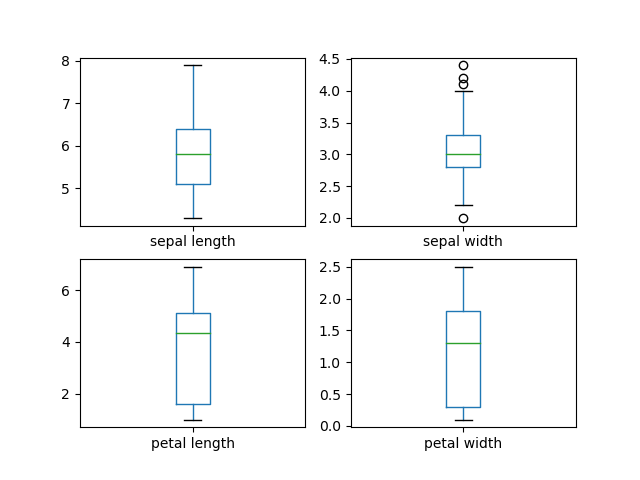

# Pands-Project2021
Project Repository for Programming and Scripting Module GMIT - 2021
Topic is research and investigation of Fishers Iris Dataset.

## Table of Contents
- [Introduction to the Iris Dataset](https://github.com/Lynch08/Pands-Project2021#introduction)
- [Planned Project Outcomes](https://github.com/Lynch08/Pands-Project2021#planned-project-outcomes)
- [The Repository Content](https://github.com/Lynch08/Pands-Project2021#the-repository-content)
- [Python and Libraries Used](https://github.com/Lynch08/Pands-Project2021#python-and-the-r-used)
- [Building and Running analysis.py](https://github.com/Lynch08/Pands-Project2021#building-and-running-analysispy)
- [Initial Research](https://github.com/Lynch08/Pands-Project2021#initial-research)
- [First Analysis](https://github.com/Lynch08/Pands-Project2021#first-analysis)
- [Visualisation and Analysis of Plots](https://github.com/Lynch08/Pands-Project2021#viualisation-and-analysis-of-plots)
- [Correlations](https://github.com/Lynch08/Pands-Project2021#correlations)
- [Summary and Conclusions of the Dataset](https://github.com/Lynch08/Pands-Project2021#summary-and-conclusions-of-the-data-set)
- [Machine Learning using the Iris Dataset](https://github.com/Lynch08/Pands-Project2021#machine-learning-using-the-iris-data-set)
- [Problems encountered with Coding](https://github.com/Lynch08/Pands-Project2021#problems-encountered-with-coding)
- [Problems encountered with Data Analysis](https://github.com/Lynch08/Pands-Project2021#problems-encountered-with-data-analysis)
- [Citations](https://github.com/Lynch08/Pands-Project2021#citations)

### Introduction to the Iris Dataset
This is a project that is going to look at the data that is commonly known as the Iris Flower Dataset or Fishers Iris dataset. 
During the research phase for this project I found that the study of this dataset seems to be the initial starting point for any would-be statistician or individual interested in studying Machine Learning and/or data visualisation.
The Dataset came to the public forefront in 1936 when statistician Sir Ronal Aylmer Fisher published his report “The Use of Multiple Measurements in Taxonomic Problems” in the journal Annals of Eugenics.
It should be noted that Fisher did not collect the data himself, the data-source was credited to Dr Edgar Anderson who collected the data at the Gaspé Peninsula in Canada.[[1]](https://towardsdatascience.com/the-iris-dataset-a-little-bit-of-history-and-biology-fb4812f5a7b5)

The dataset in itself is relatively small - 3 classes (different Iris Species - Iris Setosa, Iris Versicolour and Iris Virginica) with 50 samples of each and 4 variables of each sample (the length and width of the sepal and the length and width of the petal in centimetres). 
One species, Iris Setosa, is "linearly separable" from the other two. This means that we can draw a line between Iris Setosa samples and samples corresponding to the other two species.

From initial research it was clear that this dataset has been analysed in depth by thousands of scholars before me and there was going to be many ways to look at and represent this data.   

### Planned Project Outcomes
1. To break the project down into small manageable tasks  
2. To gain an understanding of the data presented in the Iris Data set
3. To integrate the skills I had acquired over the first 10 weeks of the programming and scripting module to analyse the data and display the findings
4. To expand my knowledge of the python libraries and tools to make the code as simple and readable as possible for the reader
5. To learn how to best optimise my time between research, programming, problem-solving and analysis.  

### The Repository Content
  - README File - This contains a description of the dataset and its history. Also includes the tools used in the completion of the project and an explanation of the code, how I proceeded to analyse the data and the conclusions drawn from that data.
  - Iris data file - This is the data set that was analysed. This was read into analysis.py by using the PANDAS library in python.
  - analysis.py - The program that I used in analysing and displaying the data. These included comments to show my understanding of the code and the were vital when documenting my analytical process.
  - Summary file - A file that contains multiple summaries of the data set as a whole and broken down by its variables and species.
  - Images Folder - Images of the plots, graphs, summary generated by analysis.py and others used to enchance the analysis. 
  - machineLearning.py - A program to show how this data set can be used as an in Machine Learning, with an example of a Machine Learning algorithm (decision tree classifier algorithm). 

### Python and the Libraries Used
Python is an interpreted, object-oriented, high-level programming language with dynamic semantics. Its high-level built in data structures, combined with dynamic typing and dynamic binding, make it very attractive for Rapid Application Development, as well as for use as a scripting or glue language to connect existing components together. [[2]](https://www.python.org/doc/essays/blurb/) Its natural functionality has been extended by development of external libraries dedicated for specific purposes.[[3]](https://www.mygreatlearning.com/blog/open-source-python-libraries/#:~:text=Python%20Libraries%20are%20a%20set,data%20manipulation%20applications%20and%20more.) Below are listed several python libraries I used for accomplishment of this project.

- Pandas:
Pandas is a software library written for the Python programming language for data manipulation and analysis. In particular, it offers data structures and operations for manipulating numerical tables and time series. It was used specifically in this project to read in the data from the csv file used.[[4]](https://pypi.org/project/pandas/)

- Numpy:
NumPy is a library for the Python programming language, adding support for large, multi-dimensional arrays and matrices, along with a large collection of high-level mathematical functions to operate on these arrays.[[5]](https://numpy.org/)

- Matplotlib:
Matplotlib is a plotting library for the Python programming language and its numerical mathematics extension NumPy.[[6]](https://matplotlib.org/)

- Seaborn: 
Seaborn is a Python data visualization library based on matplotlib. It provides a high-level interface for drawing attractive and informative statistical graphics.[[7]](https://seaborn.pydata.org/#:~:text=Seaborn%20is%20a%20Python%20data,can%20read%20the%20introductory%20notes.)

### Building and Running analysis.py
I went through many iterations of code before I came to my final draft.
I first began with wildly long ways of producing histograms for each individual histogram and plots with duplicate code all over my program. This became not only confusing for myself to read, even with comments, it became frustrating to run and test. In the end, I tried to make the code as readable and the program as user friendly and as flexible as possible. 
To run the code you will need a tool to run a python program(Python Version 3.0 or above). It was built and tested on Visual Studio Code, but can be run on other tools such as Idle or Cmdr.

Once you run the program it will automatically output a text file to the folder you ran the code from called [summary.txt](https://github.com/Lynch08/Pands-Project2021/blob/main/summary.txt). This includes
- A basic summary of the data set - a count of the 3 Species of Iris and a concise summary of the overall dataset using the pandas library
- A summary of the data set - broken down by the variables and species to for easier comparison
- A summary of the data set - broken down by individual species
- A summary of the correlations in the data set - broken down by individual species. 

Every time you run the program this summary.txt will be created if it does not exist, if summary.txt exists, the file will overwrite and save every time the program is run.

Once the summary output has been completed the user will be offered a Display Menu where they will have the option to either view individually or in sequence, or save, all the plots used for my analysis below.

If the user inputs an incorrect value, error handling will not allow this and loop to the display menu again.
Entering 0 (or Ctrl+C as normal) will allow the user to exit the program.
If any other valid option is entered, the program will display or save the relevant plot(s) and loop back to the display menu once the plot has been closed or saving the plot image has been completed. 

### Initial Research
As this was my first programming project I found the initial research of this dataset a little daunting.
There were so many ways that that this data had been previously researched and visualised in a range of disciplines - Statistics, Machine Learning, Data Representation, Data Visualisation to name a few. It was difficult to wrap my head around how this seemingly simple set of flower types and their four common, but variable attributes, were a recognised building block of some of the most intricate and complex tools that are used in computing and data science today.
After some initial head-scratching google searches I decided to start at the beginning and have a look at Fishers original report[[8]](https://onlinelibrary.wiley.com/doi/epdf/10.1111/j.1469-1809.1936.tb02137.x) - this helped a little as it really showed me he was just looking at these 150 flowers as a stand alone data set and not trying to glean any information that was not already supplied by the numbers provided to him, even if some of the mathematics involved was beyond my comprehension. From my reading of the original report, I deduced that Fisher was outlining, that by interpreting the data from these 3 species of Iris', we could identify the species of any of these iris' by using the measurements of the Sepal and Petal. 
This gave me a little confidence in the sense that I should just start from the beginning with no preconceived notions about what data was going to show me and just begin to use the skills I had acquired in my short time learning python to generate a picture of what the data was trying to display. I could dive into the further uses for how the method of my analysis could be used in other applications at a later time.

Once I felt I had done adequate research on what the data was, I decided to try some simple code to output some plots, if for nothing else to have some "physical" evidence that I was making progress. The first decision I had to make was how I wanted to have the dataset stored. I decided downloading a CSV file of the data was my best option - I was familiar with the CSV format from some light database work I had done in my professional life (importing and exporting data mainly - no real analysis) and this would be the format I would be continuing to use professionaly, so that decision was one of the easier ones I would make.
From there I did some more research and reviewed some previous labs that had touched on CSV data during the course. Once I had downloaded the dataset I began to review the course material provided for reading in CSV files using Python, and of course using internet searches and tools like [Real Python](https://realpython.com/python-csv/) and [W3Schools](https://www.w3schools.com/python/pandas/pandas_csv.asp) to guide me and give me ideas.

### First Analysis
 The first thing I did  was jump into making histograms and scatter plots and try to study them to get some insight into the data.  I quickly realised this was a mistake. I was not really able to analyse the plots as I had not summarised the basic data behind the graphs I was generating.
 I found an extremely useful function in the pandas library called describe().[[9]](https://pandas.pydata.org/docs/reference/api/pandas.DataFrame.describe.html)  This gave me some basic statistics on the data set such as mean, max, min and standard deviations.
 From these figures I could begin to do some early analysis.

  - The biggest gap between the min and max values were in the petal lengths and sepal lengths - this held through with the variance in the standard deviation.
  - From the Mean data I could see that sepal lengths and widths were, in relative terms, significantly larger than the petal counterparts.
  - Standard Deviations showed that there was a higher variance in the petal length and width than the sepal length and width - because of this higher variance level I began to wonder if the petal data was going to show me a clearer picture of the difference between species than the sepal data - more analysis would be required.

### Visualisation and Analysis of Plots
At first I had written code to display 4 histograms of each plot individually, however from using resources like stackoverflow and seeing other analysis of the dataset I had gone over the top with the code and found a much easier way to display all 4 histograms together in one multivariate display. I also found a really handy bit of code that allowed me to display the data in a bar graph that I found much easier to analyse. This allowed me to make clear distinctions between variables.[[10]](https://stackoverflow.com/questions/45721083/unable-to-plot-4-histograms-of-iris-dataset-features-using-matplotlib)[[11]](https://www.datacamp.com/community/tutorials/histograms-matplotlib)[[12]](https://github.com/Datagatherer2357/Gareth-Duffy-GMIT-Project)

The plots above confirmed my initial analysis. The histogram and bar chart both showed that although the Sepal had the higher maximum values in its variables (length and width) the variance, or standerd deviation was notably less between the species than that of the petal. This indicated to me once again, that if I was ever to give advice to an aspiring botanist about the difference between iris species, it would be "look at the petal". 
The histograms indicated the variance spread with wide data range on the petal measurements and the bar chart then confirmed this clearly showing the setsosa was far smaller than the other two species. In contrast the sepal values were far closer together in the bar chart and the histogram showed the variance was much more clustered.

Next I decided to analyse the data using a very simple but effective tool in the seaborn library called pairplot - this allows you to visualise the measurements between each variable, and distinguishes by object type(species).
A pairplot allows us to see both distribution of single variables (Univariate histograms) and relationships between two variables(Scatter plots). Pair plots are a great method to identify trends for follow-up analysis and, fortunately, are easily implemented in Python.[[13]](https://www.kaggle.com/mervinpraison/seaborn-pairplot-with-iris-dataset)

When looking at the pairplot scatter plots it is clear from a glance that Iris-Setsosa is linearly separable in almost all cases from the other species. Both sepal and petal length are significantly smaller than the Iris-Versicolor and Iris-Virginca and from the histogram we again can clearly see the Iris-setsosa is far smaller and the variance of the petal length was smaller so most likly more distinct. 
As I did my research on how to read these plots correctly, I was a little fearful I would make some false assumptions based off my limited experience analysing data in this format. To verify my analysis I went back to the describe function, however this time I grouped the data by species and ran it to make it easier for comparison. In doing this I was able to make assumptions based off my reading of the plots and verify my assumptions with the figures provided - this was added to my data summary (summary.txt file).
From the pairplot and the breakdown of the numerical data by species I reached some of my first conclusions.

- Because of the distinctly small size and variance of the Iris-Setsosa petals they are easily more distinctive then the other two species in the data set.
- There is some crossover (not linearly separable) of the Iris-Versicolor and Iris-Virginica however from the graphs and data already generated to this point we can see that some trends are beginning to emerge.
- The Iris-Virgina seemed, in most cases to have a bigger petals and sepals than the Iris-Versicolor, this was reflected in the numerical data, as all mean data across the 4 variables was higher, however from the plots and the cross over between the max and min values of the variables of the 2 species, it was evident the distinction between these was not going to be as clear-cut.

I then began to play with other types of plots that were really new to me. I had at least a basic understanding of histograms, bar charts and scatter plots and they were easier enough to read, but now as I was diving deeper into the analysis I was coming across analysis tools I had zero experience with such as box plots, swarm plots and heat maps.

I should say at this point I was getting a little frustrated with having to run my entire program every time I wanted to see a specific plot for comparison. This led me to creating functions for each of the plots in my code, and creating a display menu so I could call on any specific plot that I wanted easily. From this I got the idea to allow the user to simply display or save all of the plots. This way by running the programme the user could jump back and forth between plots, or save them as a group for later analysis.

I used a box plot and swarmplots (4 swarm plots that showed the distribution by species) to demonstrate the distribution differences between each of the variables and the species.
Once again the data showed me that there was a much larger distribution of the sepal measurements. This was reinforcing my earlier analysis that the petal size would be a far better indicator of species based on analysis. [[14]](https://www.geeksforgeeks.org/box-plot-and-histogram-exploration-on-iris-data/)

A boxplot is a way to show a five number summary in a chart. The main part of the chart (the “box”) shows where the middle portion of the data is: the interquartile range. At the bottom of the box, you find the first quartile (the 25% mark) and the third quartile (top) (the 75% mark). The bottom of the chart (at the end of the bottom “whisker”) is the minimum (the smallest number in the set) and the top is the maximum (the largest number in the set). Finally, the median is represented by a vertical bar in the centre of the box.[[15]](https://www.statisticshowto.com/probability-and-statistics/descriptive-statistics/box-plot/#:~:text=Back%20to%20Top-,How%20to%20Read%20a%20Box%20Plot,(the%2075%25%20mark))

I found the swarmplots below a good way to visualise the distribution.
You can clearly see that although the sepal lengths have a wider variance, the crossover is far more evident than with the petal. You can also see the petal lengths and widths for the Iris-Setsosa are clearly distinct from the other two species.[[16]](https://www.kaggle.com/rakesh6184/seaborn-plot-to-visualize-iris-data)

### Correlations
I used a heat map to help me with analysing the correlations between the variables. Although the data is duplicated on this map I found an extremely helpful visualisation tool and easy to read.
Where the correlation is 1 or 'reddest' we can see that the variable data will be the same so the correlation will match - the further the figure is away from 1 (going from red to blue to purple), the less correlation there is. [[17]](https://www.kaggle.com/kamrankausar/iris-dataset-ml-and-deep-learning-from-scratch/notebook  )

The least correlation happens between petal values and sepal width (-.42 and -.36). 
We can see the highest correlation between the between petal length and width (.96) - this tells us as one gets larger, so does the other, and this number is so close to 1 I began to assume this is the case across all species.
Surprisingly to me, there was a high correlation between the petal values and the sepal length (.87 and .82, petal length and width respectively) This correlation was surprising as it was so low with the sepal width. 
I was able to conclude from this data that the sepal width did not strongly correlate with any of the other variables.

However because my interest was now peaked by the fact the sepal variables did not strongly correlate, I decided once again, to go back to the describe() function to create an indidual table for each species - this was added to the summary.txt file. This was not great for visualisation and I had found the heat map far more user friendly, so I decided to generate one for each species. The combination of the text summary and the heat maps, led to some very interesting findings.

Firstly the correlations that I had found with the overall dataset did not seem to carry over to the correlations of the grouped species.

Specifically while the overall data set showed correlation between the petal length and width, this was not reflected when broken down by species - it dropped below the overall number of .96 in all cases.
Secondly, the weakest variable for correlation of the overall data set, the Sepal width, went from being negative to positive across all species, most notably with the Iris-Setsosa.
This trend continued across almost all variables where the inital correlations from the overall dataset were remarkably different to correlations of the variables when analysed by species. 

This led me to double check my data and do some googeling to ensure my code was correct. From my research I found that this was a known phenomenon with the dataset, and many other datasets called Simpsons Paradox.
Simpson’s paradox, also called Yule-Simpson effect, in statistics, an effect that occurs when the marginal association between two categorical variables is qualitatively different from the partial association between the same two variables after controlling for one or more other variables. [[18]](https://www.britannica.com/topic/Simpsons-paradox)
This was interesting and led me to reading up more on Simpsons Paradox.
It was a good learning experience as it taught me not to take for granted the relationship between two variables if there was one or more other variable in the dataset. My further research on this informed me that this was not a particularly rare occurrence in the world of Data Analysis.[[19]](https://medium.data4sci.com/causal-inference-part-i-415538211aa1)

### Summary and Conclusions of the data set
- The Iris-Setsosa is a distinctly different species to the Iris-Versicolor and Iris-Virginica
- There is much more data overlap with the Iris-Versicolor and Iris-Virginica
- The Petal Length and Width are much clearer distinguishing attributes than the Sepal Length and Width
- It is vital to verify your findings using numerical statistical analysis and not to depend too heavily on the visualisation, and vice versa.
- Simpsons Paradox can lead you to inccorrect assumptions, so beware how one variable can impact the correlation between two other variables.

### Machine Learning using the Iris data set
During my research of this project, time and time again I came across the machine learning and predictive analysis that had been done using this data set. I came across a variety of algorithms that had been used to analyse this data set including, Support Vector Classification(SVM), Nearest Neighbour(K-NN), Decision Tree and Random Forest[[20]](https://www.kaggle.com/aceccon/2-iris-dataset-basic-classification-algorithms). 

I decided to add an example to this project although it is slightly outside the scope.
For this I created a separate program called machineLearning.py. This program is a basic example of "Supervised Learning" using the ScikitLearn Library from python.

I will admit that I fell down a bit of a rabbit hole here and probably spent a little too much time trying to understand the intricacies of the algorithms without any previous experience or guidence. However I found it fascinating, and was astounded that these algorithmic tools were not that difficult to use, even if you did not really fully understand the mathematics behind them. However of course for real world usage outside of this project a more comprehensive understanding would be required to be able to stand over the data.

The algorithm I chose for my example was a decision tree classifier algorithm. I found that it was one of the easier algorithms to comprehend and found a good relatable example of how it works here,[[stackabuse]](https://stackabuse.com/decision-trees-in-python-with-scikit-learn/). 
The ScikitLearn tool will analyse or "learn" about the data set using regressional analysis.
The program will then ask the user to input new measurements for the Sepal and Petal lengths and widths, and from what it has learned about the previous data set make a prediction of what the species of Iris is based on the new values.
It will also give the user an indication of the accuracy of its prediction.

It should be noted the idea and code for this example was adapeted from a previous GMIT student pands project [[Duffy, Gareth]](https://github.com/Datagatherer2357/Gareth-Duffy-GMIT-Project/blob/master/project.py).
Also I used the iris dataset provided by the ScikitLearn library as it was easier to implement the code - so there may be some very, very slight discrepancies between the data used in analysis.py and machineLearning.py. 

## Problems encountered

  ### Problems encountered with coding
   - I had some issues trying to separate the data out for the correlation part, it took a lot of googleling and reading up on the groupby() function.[[21](https://pandas.pydata.org/pandas-docs/stable/reference/api/pandas.DataFrame.groupby.html)
   - One of my regrets is that I failed to get the swarmplots all on to one .png. I did a lot of research but could not seem to nail it. It led to me having to create 2 functions, for both the swarm plots and species specific heat maps, one for show and one for saving. I would have liked that to be neater.
   - Old code - I found that some of the code I encountered during my research was using old parameters in the functions, I had to make some changes and read up on how to correct this. 
   Example:  
   UserWarning: The `factorplot` function has been renamed to `catplot`. The original name will be removed in a future release. Please update your code. Note that the default `kind` in `factorplot` (`'point'`) has changed `'strip'` in `catplot`. 
   - Rerunning my code - I found it extremely irritating that I was having to run through each plot every time I added something new to my code. I did a number of things to help me out here.
   1. Set the first input in my summary to 'w', and the rest to 'a', this allowed me to overwrite and append every time so every time I ran the program I was able to test that my summary.txt file had not been corrupted
   2. I created my plots as functions this allowed me to call them when required and gave me flexibility of when I wanted to save and show.[[22]](https://realpython.com/defining-your-own-python-function/)
   3. Added looping and an exit button for my program - this was really helpful, I added a while loop that allowed me to run again without having to rerun the program from the command line and an exit input (0) for my program, this allowed me to get out quickly to make a change when I desired.[[23]](https://realpython.com/python-while-loop/) 

### Problems encountered with data analysis
 - Unfamiliarity with some of the analysis tools. Outside my obvious rookie user level with python I found some of the plots and graphs tough to analyse at the beginning. I could understand the normal histograms and scatter plots to a certain level, as I cited above, I had to do some research on things like box plots, swarm plots and heat maps. However once I had done the research I found them extremly valuable, especially the swarm plots and heat maps.
 -  Volume of data - there was so much data and research done on the Iris Data set it was a little daunting to try to figure out where to begin. However it was a lot of comfort to be part of the discord group with my classmates to see I was not the only one that had this anxiety. This along with the time given to complete the project, and being able to refer back to my labs, really helped me to get through it bit by bit.
- Math - It had been awhile since I had tried my hand at math that could not be done by a simple calculator. Some terms such as Standard Deviation were a little frightening at the beginning, luckily YouTube was a great help here to get me reacquainted with the basics once again. Once I was comfortable with the basics I was able to see how these were really valuable when applied to the dataset and allowed me to make assumptions and clear analytical statements from what the data was expressing through these mathematical functions.
 
### Citations
1.	https://towardsdatascience.com/the-iris-dataset-a-little-bit-of-history-and-biology-fb4812f5a7b5 
2.	https://www.python.org/doc/essays/blurb/
3.	https://www.mygreatlearning.com/blog/open-source-python-libraries/#:~:text=Python%20Libraries%20are%20a%20set,data%20manipulation%20applications%20and%20more.
4.	https://pypi.org/project/pandas/ 
5.	https://numpy.org/
6.	https://matplotlib.org/ 
7.	https://seaborn.pydata.org/#:~:text=Seaborn%20is%20a%20Python%20data,can%20read%20the%20introductory%20notes. 
8.	https://onlinelibrary.wiley.com/doi/epdf/10.1111/j.1469-1809.1936.tb02137.x
9.	https://pandas.pydata.org/docs/reference/api/pandas.DataFrame.describe.html
10.	https://stackoverflow.com/questions/45721083/unable-to-plot-4-histograms-of-iris-dataset-features-using-matplotlib
11.	https://www.datacamp.com/community/tutorials/histograms-matplotlib 
12.	https://github.com/Datagatherer2357/Gareth-Duffy-GMIT-Project
13.	https://www.kaggle.com/mervinpraison/seaborn-pairplot-with-iris-dataset
14.	https://www.geeksforgeeks.org/box-plot-and-histogram-exploration-on-iris-data/ 
15.	https://www.statisticshowto.com/probability-and-statistics/descriptive-statistics/box-plot/#:~:text=Back%20to%20Top-,How%20to%20Read%20a%20Box%20Plot,(the%2075%25%20mark) 
16.	https://www.kaggle.com/rakesh6184/seaborn-plot-to-visualize-iris-data 
17.	https://www.kaggle.com/kamrankausar/iris-dataset-ml-and-deep-learning-from-scratch/notebook  
18.	https://www.britannica.com/topic/Simpsons-paradox
19.	https://medium.data4sci.com/causal-inference-part-i-415538211aa1
20.	https://www.kaggle.com/aceccon/2-iris-dataset-basic-classification-algorithms
21.	https://pandas.pydata.org/pandas-docs/stable/reference/api/pandas.DataFrame.groupby.html
22.	https://realpython.com/defining-your-own-python-function/
23.	https://realpython.com/python-while-loop/

### Other Links used in Research

24. https://www.youtube.com/watch?v=p5xThuN3P0I (Standard Deviation explained)
25. https://www.youtube.com/watch?v=FLuqwQgSBDw (Iris Dataset EDA Lecture1@ Applied AI Course)
26. https://www.youtube.com/watch?v=hd1W4CyPX58 (Getting started in scikit-learn with the famous iris dataset)
27. https://www.youtube.com/watch?v=HXi9cl5Aq5w (Working With Iris.csv | Iris Data Set In Less Than 10 minutes | Great Learning)
28. https://www.youtube.com/watch?v=bmq7hkvfkVw (Random Forest Model - Iris Data)
29. https://stackabuse.com/decision-trees-in-python-with-scikit-learn/
30. https://www.youtube.com/watch?v=BD3-2VO3Mpg (Decision Tree Classifier in Python (IRIS data) | Machine Learning)
31. https://github.com/jennifer-ryan/iris-data-set-project (Example GMIT pandas Project)
32. https://towardsdatascience.com/decision-trees-in-machine-learning-641b9c4e8052 (decision tree classifier algorithm explaination and examples)

